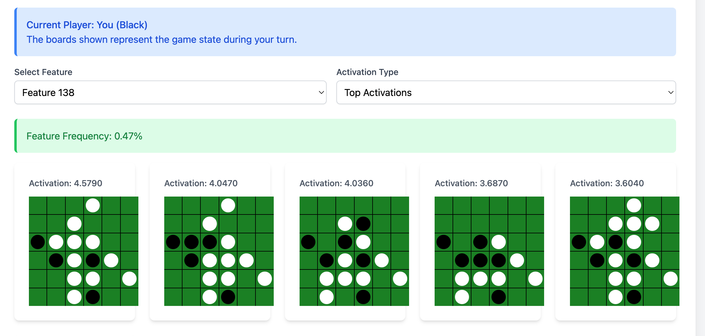
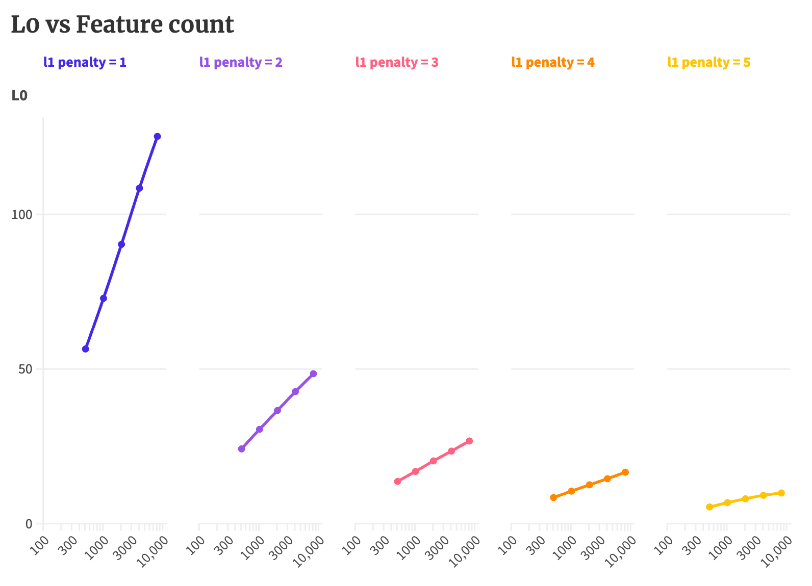
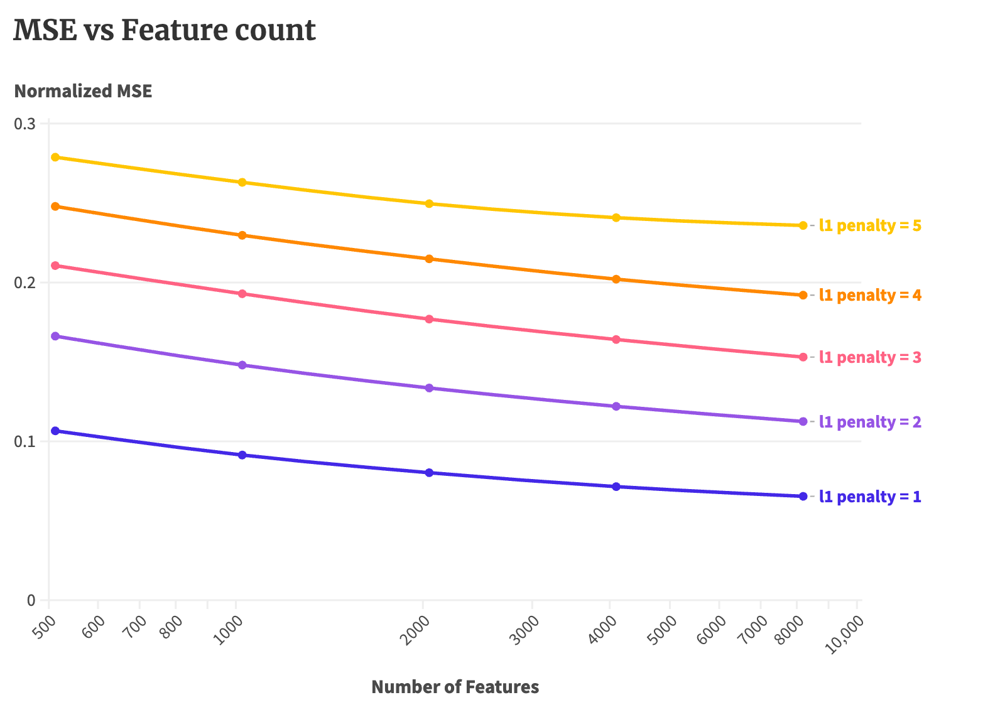
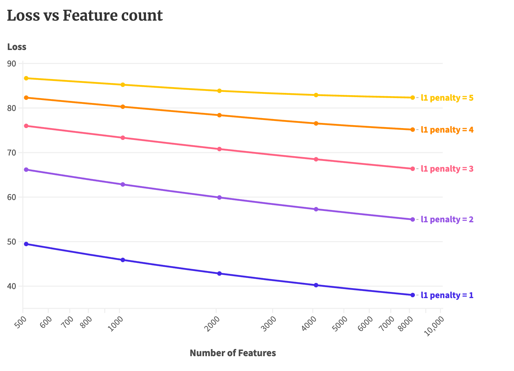
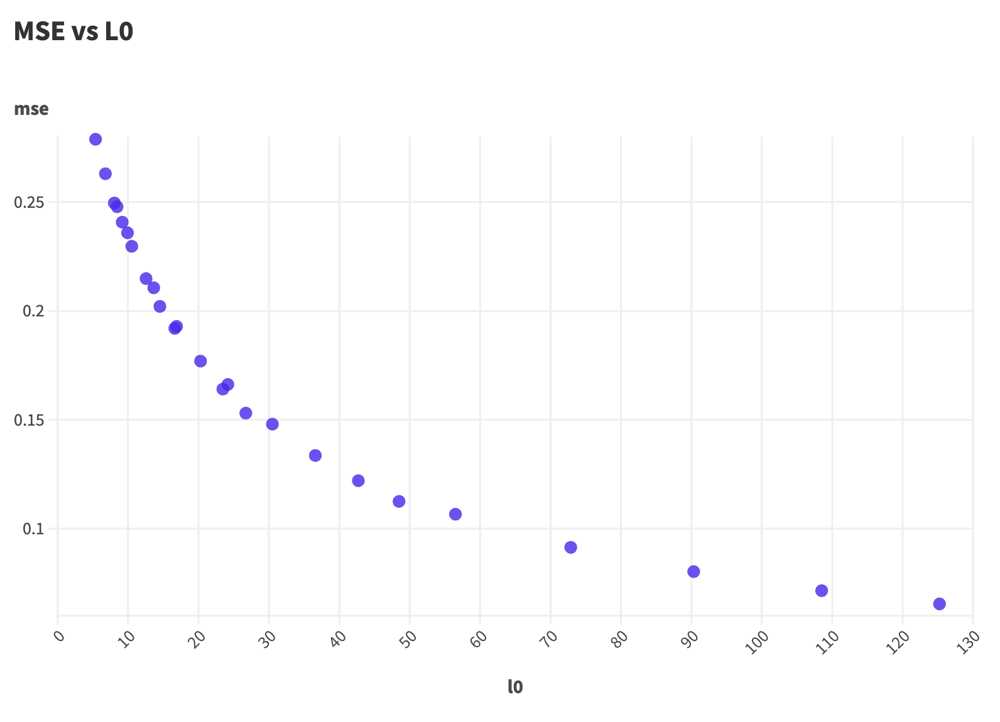

# Alpha Zero SAE
Sparse Autoencoders (SAEs) are a class of models used to find interpretable features in a model's activation space. They have become a useful tool for understanding language models' internals since they were [introduced](https://transformer-circuits.pub/2023/monosemantic-features/index.html) last year.

The goal of this repo is to use SAEs to extract novel features from a model that is superhuman at a task, unlike current generation LLMs. This [paper](https://arxiv.org/pdf/2311.02462) from DeepMind puts [AlphaFold](https://deepmind.google/technologies/alphafold/) and [AlphaZero](https://deepmind.google/discover/blog/alphazero-shedding-new-light-on-chess-shogi-and-go/) in that category. We train AlphaZero to play the board game Othello and use it as our subject model.

## Quick Start: Explore the Features

### Option 1: Hosted Visualization (Recommended)

[**View the Interactive Visualization**](http://www.pavankatta.com/alphasae)

This is the quickest way to explore the extracted features:

- Loading takes 3-4 seconds initially, faster on subsequent loads due to caching.
- Qualitatively, SAEs with L1 penalties 3 and 4, and feature counts of 1024 and 2048 are more interpretable.

### Option 2: Local Visualization

If you prefer to run the visualization locally:

```bash
cd vis
./download_vis_data.sh # You may need to chmod +x first
python -m http.server 8000
```

Then open `http://localhost:8000` in your browser. It should look like this:


## Dependencies

This project requires only 4 dependencies: torch, numpy, tqdm, and wandb (optional, for logging). See `requirements.txt` for details.

## Training Your Own SAEs

To train your own Sparse Autoencoders:

1. Download the training data (model activations):
    
    ```bash
    ./sae/download_sae_data.sh
    ```
    
2. Run the training script:
    
    ```bash
    python train_sae.py
    ```

## Data and Code

- All data is hosted on [Hugging Face](https://huggingface.co/datasets/pavanyellow/othello/tree/main).
- To generate your own data, use:
    - [collect_activations.py](https://github.com/pavanyellow/alphasae/blob/main/othello/collect_activations.py)
    - [generate_vis_data.py](https://github.com/pavanyellow/alphasae/blob/main/vis/generate_vis_data.py)

## Training Your Own AlphaZero

This repo uses a modified version of the AlphaZero implementation from [alpha-zero-general](https://github.com/suragnair/alpha-zero-general). It's trained to play Othello on a 6x6 board. Othello is a popular board game typically played on an 8x8 board. To better understand the features extracted, we recommend playing a game [online](https://playpager.com/othello-reversi/).

Key files:

- [model.py](https://github.com/pavanyellow/alphasae/blob/main/othello/model.py): Contains the neural network architecture. We've replaced the original 8-layer ConvNets with 4-layer Residual blocks with a Feed-forward layer similar to those in Transformers. This change allows training on an M1 Air in just 15 minutes, achieving performance similar to the original implementation which took 3 days on an NVIDIA K80 - a 250x improvement without using GPUs.
- [coach.py](https://github.com/pavanyellow/alphasae/blob/main/alphazero/Coach.py): Handles self-play and evaluation.
- [mcts.py](https://github.com/pavanyellow/alphasae/blob/main/alphazero/MCTS.py): Implements Monte Carlo Tree Search.
- [NetworkWrapper.py](https://github.com/pavanyellow/alphasae/blob/main/othello/NetworkWrapper.py): Contains the training loop for the neural network.

To train your own model:

```bash
python train_alphazero.py
```

To play against your trained model or pit it against another AI:

```bash
python othello/play.py --human  # Play against the AI
python othello/play.py --games 10  # AI vs AI for 10 games
```

## SAE Experiments

Sparse Autoencoder is a simple 2-layer feed-forward network. It takes an input vector, expands it into a higher dimension, and then compresses it back into the original dimension. Here's the simplest autoencoder possible:

```python
input = torch.randn(5)
encoder, decoder = nn.Linear(5,20), nn.Linear(20,5) # Two Feed-forward layers
encoded = nn.ReLU(encoder(input))  # ReLU is applied after layer 1
output = decoder(encoded)         # Inputs are reconstructed from the encoded representation
l1_penalty = 5                    # L1 penalty used to control sparsity
loss = ((output-input)**2).sum() + l1_penalty*encoded.sum() # Reconstruction error + sparsity loss
```
The [theory](https://transformer-circuits.pub/2022/toy_model/index.html#strategic-approach-overcomplete) is that `encoded[i]` is more interpretable than `input[i]`.
I've trained 25 SAEs with L1 penalties `[1, 2, 3, 4, 5]` and number of features `[256, 512, 1024, 2048, 4096]`. All the models were trained with:
- Batch size: 16384
- Learning Rate: 0.0001 (Selected through a hyperparameter sweep)
- Input: Layer 2 residual stream (dim = 256) activations from AlphaZero
- Number of Training Examples: 3M activations
- Epochs: 12000
- Hardware: RTX 4090
- Training Time: 1-30 minutes depending on the model size

Here are some scaling trends we observe over different model sizes. Note that the X-axis (Number of features) is in log scale! Details of these runs can be found at [scaling.json](https://huggingface.co/datasets/pavanyellow/othello/blob/main/scaling.json).









## Acknowledgements

- [AlphaZero General](https://github.com/suragnair/alpha-zero-general) for reference implementation of AlphaZero.
- Anthropic for publishing their [SAE training setup](https://transformer-circuits.pub/2024/april-update/index.html#training-saes)
- [Scaling Scaling Laws with Board Games](https://arxiv.org/abs/2104.03113) which influenced a lot of my training decisions.
